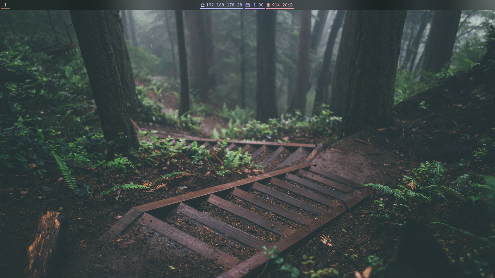
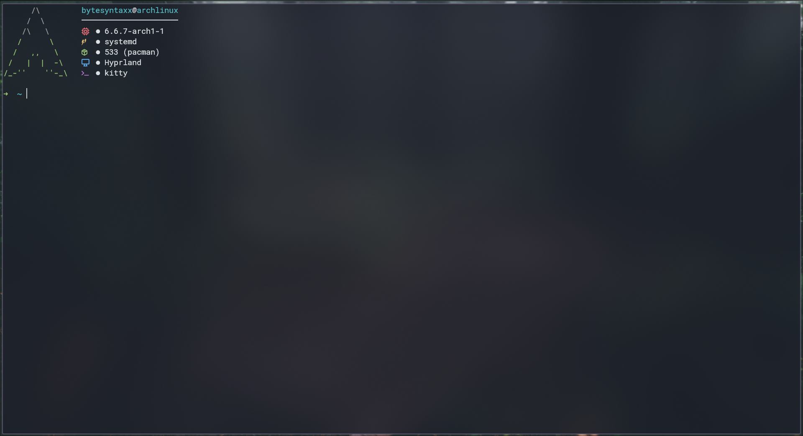
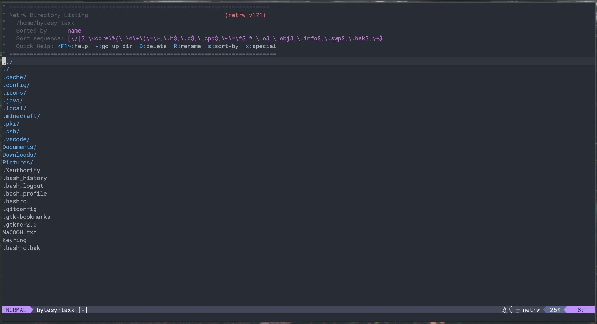

# Dotfiles

#### Installed Packages: ```hyprpland-dev wofi waybar neovim kitty kitty-shell-integration ttf-roboto```
#### Installed Fonts: ```ttf-roboto ttf-jetbrains-mono ttf-firacode-nerd ttf-noto-nerd noto-fonts-emoji```

## Screenshots
| Hyprpland / Desktop |
|:-:|
||

| Kitty Terminal Emulator |
|:-:|
||

| Neovim Text Editor |
|:-:|
||
